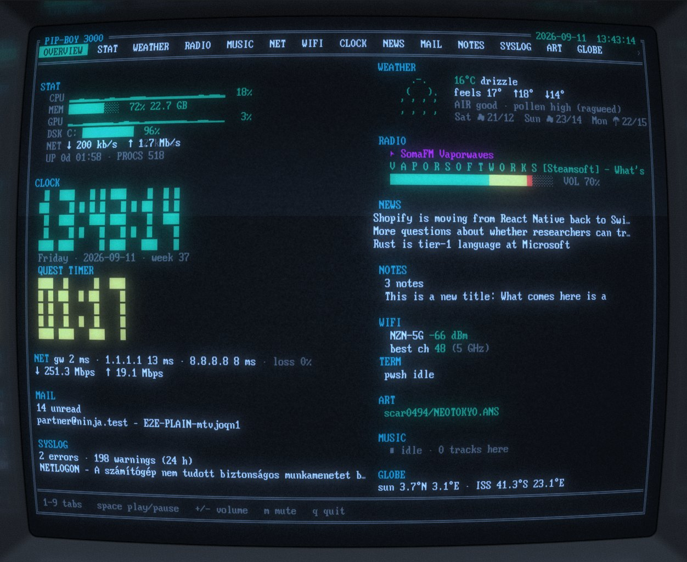
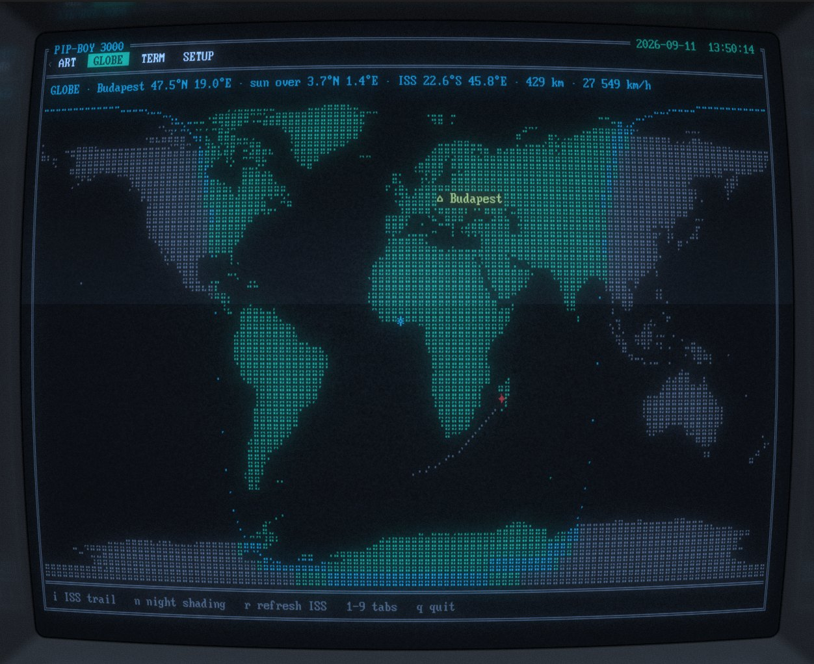
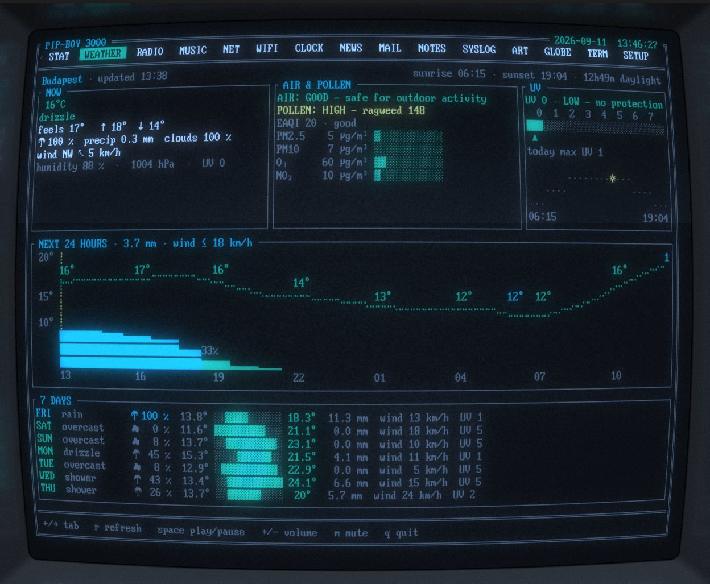
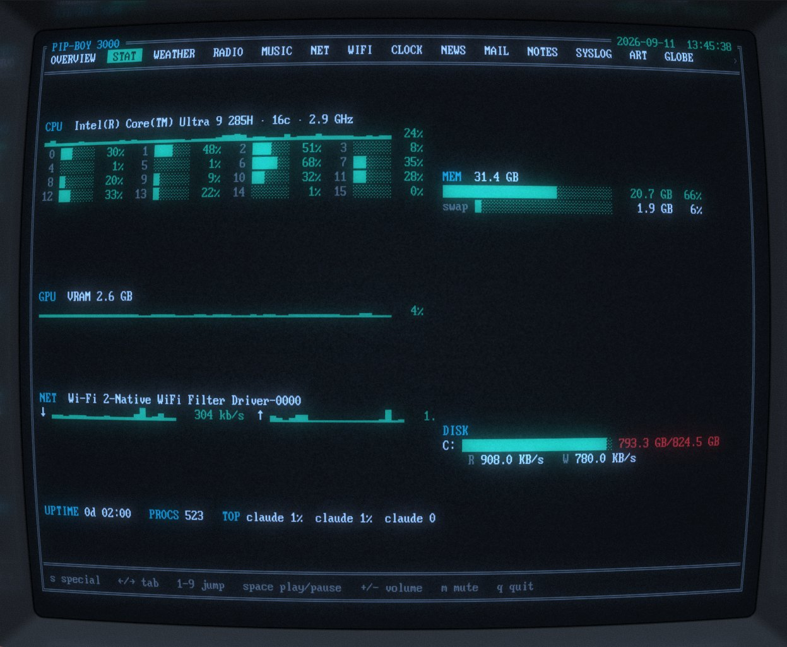
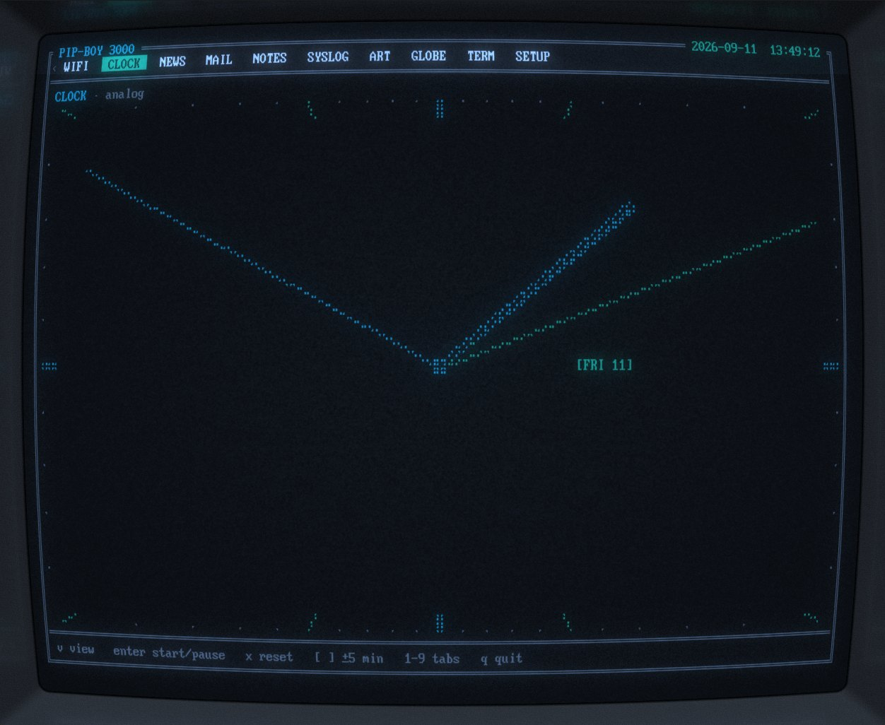
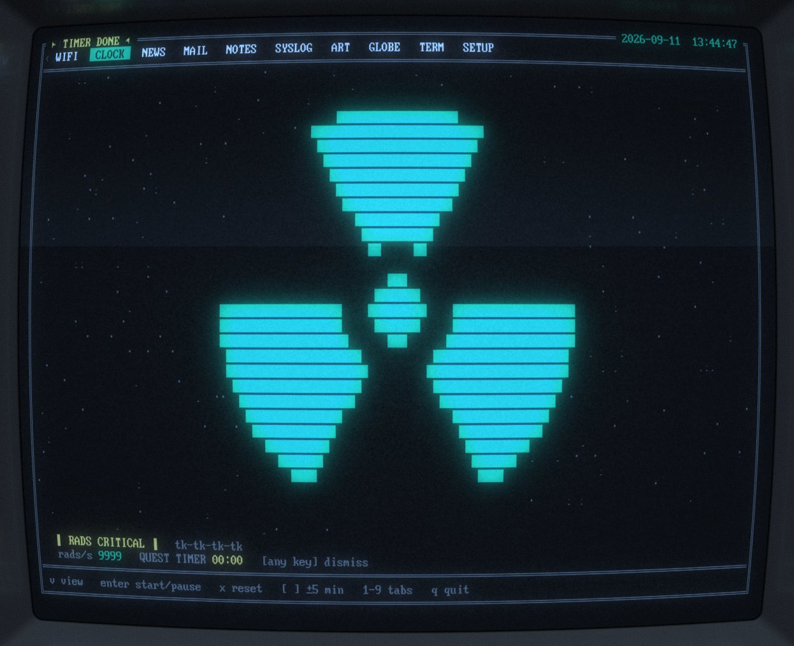
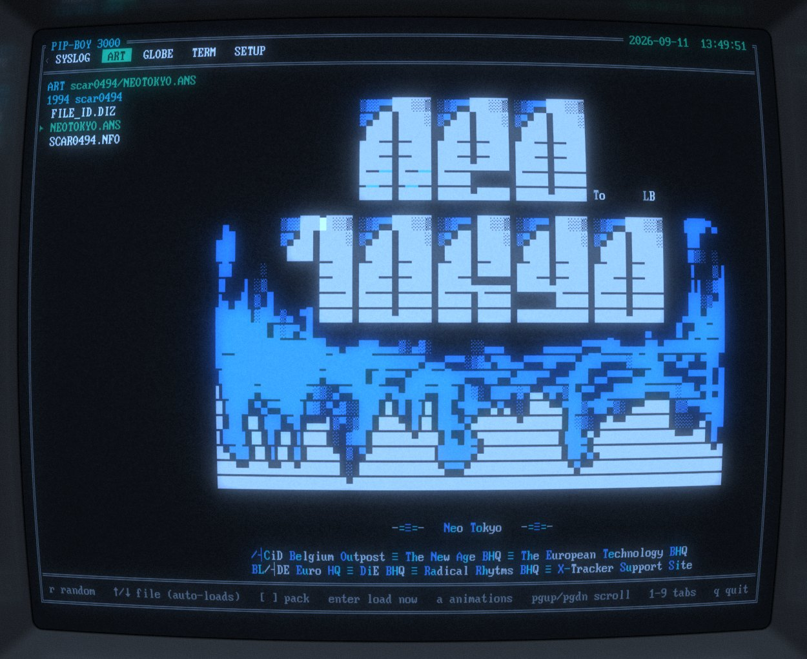

# PipBoyCRT



**PipBoyCRT is a Fallout Pip-Boy for your desk.** It is a terminal dashboard
for Windows that puts the things you would otherwise open five apps for —
system load, weather, radio, your inbox, the news, notes, the Wi-Fi around you,
a world map — on one retro CRT screen, one tab each, made to be glanced at
rather than operated.

- **What it is** — a single small `pipboy.exe` written in Rust with
  [ratatui](https://ratatui.rs). No installer, no accounts, no API keys, no
  telemetry; it only writes next to itself. It draws with the 16 ANSI colours,
  so it works in any terminal, and it looks the part inside
  [cool-retro-term-windows](https://github.com/pushingpandas/cool-retro-term-windows),
  which supplies the CRT glow (see [Getting started](#getting-started)).
- **What it gives you** — seventeen tabs (below), an OVERVIEW that composes the
  important bits of all of them, a header with the battery, the playing station
  and the unread count, and a SETUP tab to switch off what you don't need.
- **What it is for** — a second monitor, an old laptop on the shelf, the
  terminal you keep open anyway: leave it running and look at it. It idles at
  4 frames per second and speeds up only where something moves.
- **What it is not** — a file manager, a mail client or a chat: those exist as
  their own terminal programs, and the TERM tab runs them.

### The tabs

| Tab | What it shows |
|---|---|
| **OVERVIEW** | Everything at a glance: compact stats, big clock and quest timer, weather, radio with VU, news, mail, notes, Wi-Fi, syslog, globe |
| **STAT** | CPU per core, memory, GPU, disks, network throughput, battery, uptime, top processes; `s` flips to a **S.P.E.C.I.A.L.** character sheet derived from the machine, perks included |
| **WEATHER** | Open-Meteo, no key: NOW panel with a block-font temperature, AIR & POLLEN with a plain-language verdict, UV scale, sunrise-to-sunset arc, 24-hour temperature curve with labelled points over precipitation bars, 7-day ranges |
| **RADIO** | Internet radio with ICY track titles, 37 international stations built in, spectrum VU; `*` saves the playing track into your notes |
| **MUSIC** | Your own music folder as a browser (mp3, aac/m4a, flac, wav), shuffle, VU; it and RADIO pause each other |
| **NET** | Ping to the gateway and public resolvers with sparklines and loss, traceroute, a Cloudflare down/up SPEEDTEST with history |
| **WIFI** | Networks in range with band, channel, dBm; channel congestion as bell curves; best channel per band; connect with a password prompt |
| **WASTELAND** | Every device on your local network: who is home, who is asleep, who is new — name, vendor, MAC, last seen, with an optional ping sweep |
| **CLOCK** | Big clock, world clocks, sun & moon, a quest timer that ends in a radiation alarm; `v` cycles a full-screen shadowed digital clock and a full-panel analog dial with a day/date window |
| **DOSIMETER** | Screen time as a radiation dose: a RADS readout in block font, a 24-hour strip of the day, and a 45-on / 15-off rule that alerts with a Geiger burst when the dose goes critical |
| **NEWS** | Hacker News front page plus your RSS/Atom feeds, with a reader view and on-demand article fetch |
| **MAIL** | Your inbox through the Himalaya CLI: list, reader, unread count — read-only, credentials stay in Himalaya |
| **NOTES** | Sticky notes in `notes.md` with a Notepad-like editor |
| **SYSLOG** | The last 24 hours of Windows event-log errors and warnings, with details |
| **ART** | A holotape gallery: ANSI art from the 16colo.rs archive and ascii.live animations |
| **GLOBE** | A braille world map with the day/night terminator, your location, the subsolar point and the live ISS |
| **TERM** | A real terminal inside the Pip-Boy (`pwsh` by default) — run `claude` in it with the shipped Vault-Tec persona |
| **SETUP** | Switch modules on and off, with a line about each; disabled ones never start |

## Gallery

| | |
|---|---|
|  |  |
|  |  |
|  |  |


## Getting started

### What you need

- **Windows 10 or 11, x64.** Nothing is installed; the app is one folder.
- **[cool-retro-term-windows](https://github.com/pushingpandas/cool-retro-term-windows)**
  — the CRT look comes from the terminal, not from the app. Any terminal works
  (Windows Terminal included), but this is the one it was made for.
- **Optional, per tab:** an internet connection (WEATHER, RADIO, NEWS, ART,
  GLOBE, SPEEDTEST), the [Himalaya](https://github.com/pimalaya/himalaya) CLI
  for MAIL, a music folder for MUSIC, the `claude` CLI if you want it in TERM.
  Every tab without its source just says so; nothing crashes, and you can
  switch any tab off on the SETUP tab.

### Install

1. Download `pipboy-windows-x64.zip` from the
   [Releases page](https://github.com/nyzoli/PipBoyCRT/releases/latest).
2. Unzip it anywhere — say `C:\Tools\PipBoyCRT\`. It contains `pipboy.exe`, a
   sample `config.toml` and the `vault` folder (the persona for `claude` in TERM).
3. Open `config.toml` in any editor and set at least `[weather] name / lat / lon`
   to your city. Everything else has a working default.

### Windows Defender may stop it

The exe is not code-signed (that costs money and a company; this is a hobby
project), so the first start can trigger **SmartScreen** ("Windows protected
your PC" → *More info* → *Run anyway*) or, on machines with stricter
**Defender ASR rules**, a silent block or a "Failed to run" message. Nothing is
wrong with the file: every release is built by GitHub Actions on a clean
Windows runner from the source you can read here, with the standard MSVC
toolchain, and the zip's SHA-256 is shown on the release page. If Defender
keeps quarantining it, add the folder as an exclusion (Windows Security →
Virus & threat protection → Exclusions) or build it yourself with
`cargo build --release` — the result is byte-for-byte the same program.

### Run it in cool-retro-term

1. Start cool-retro-term-windows first and pick a profile: **Profiles → Deep
   Blue** is what the screenshots use (Monochrome Green and Default Amber look
   just as good; the app only uses the 16 ANSI colors, so every theme works).
2. In **Settings → Terminal** set **Line Spacing to 0 %** — the ART tab and the
   block fonts of CLOCK and WEATHER are drawn with block characters that must
   touch; with a gap they fall apart. The screenshots use the bundled
   *BigBlue Terminal* font at 85 % scaling.
3. Give the window room: 80×24 is the minimum for every tab, 120×40 or more
   shows everything at once. At full screen the OVERVIEW is a proper wall panel.
4. In the terminal, go to the folder and start the app:

   ```powershell
   cd C:\Tools\PipBoyCRT
   .\pipboy.exe
   ```

### What to expect

- The first frame is up in well under a second; the tabs fill in as their
  sources answer (weather and news in a few seconds, MAIL when Himalaya
  replies). Radio streams start on `Space` or `Enter`.
- It uses almost no CPU while idle (4 frames per second) and speeds up to 20
  only on tabs that move — the radio's VU meter, a running speed test, an
  animation in ART, the terminal in TERM.
- It writes only next to itself: `config.toml` (the SETUP tab updates the
  `[shell] disabled` list), `notes.md` (NOTES and the radio's favourite tracks),
  `speedtest.log`, `dosimeter.log` (closed screen-time sessions and breaks) and
  `wasteland.json` (remembered devices and their names). No registry, no
  `%APPDATA%`, no telemetry.
- `q` or `Ctrl+C` quits; `Esc` never does — inside a tab it means "back".

## Build

Prerequisites (the standard Rust-on-Windows setup):

- Rust stable via [rustup](https://rustup.rs) (MSVC toolchain, the default on Windows)
- Visual Studio Build Tools with the "Desktop development with C++" workload
  (provides the MSVC linker and the Windows SDK)

Then:

```powershell
cargo build --release
copy config.toml target\release\
.\target\release\pipboy.exe
```

The release binary is statically linked (`+crt-static`) and has no runtime DLL
dependencies. Prebuilt binaries are attached to GitHub releases (`v*` tags) by
the CI workflow, which builds and tests on a clean `windows-latest` runner.

If Microsoft Defender's ASR rule "Block executable files unless they meet a
prevalence, age, or trusted list criterion" is enforced on your machine, freshly
built executables (including cargo build scripts) are blocked with
"Access is denied (os error 5)"; add an ASR exclusion for the `target` folder.

### Alternative toolchain (no MSVC)

The project also builds with `stable-x86_64-pc-windows-gnullvm`. With
[llvm-mingw](https://github.com/mstorsjo/llvm-mingw) installed nothing else is
needed. Without it, point cargo at rustup's bundled `rust-lld` in a cargo config
outside the repository (for example `~/.cargo/config.toml`):

```toml
[target.x86_64-pc-windows-gnullvm]
linker = "<rustup home>/toolchains/stable-x86_64-pc-windows-gnullvm/lib/rustlib/x86_64-pc-windows-gnullvm/bin/rust-lld.exe"
rustflags = ["-C", "linker-flavor=ld.lld", "-C", "link-self-contained=yes"]
```

`build.rs` then supplies the missing Windows import libraries from the
`winapi-x86_64-pc-windows-gnu` crate. On MSVC `build.rs` does nothing.

## Keys

| Key | Action |
|---|---|
| `←` `→` `Tab` `Shift+Tab` | switch tab |
| `1`–`9` | jump to OVERVIEW / STAT / WEATHER / RADIO / MUSIC / NET / WIFI / WASTELAND / CLOCK (DOSIMETER, NEWS, MAIL, NOTES, SYSLOG, ART, GLOBE and TERM follow: `←` `→`) |
| `↑` `↓` `Enter` | RADIO: select / tune station |
| `*` | RADIO: save the playing track (artist – title) into the `Favorite tracks` note in `notes.md` |
| `Space` | play / pause (from any tab) |
| `+` `-` | volume ±5 % |
| `m` | mute |
| `s` | STAT: toggle the S.P.E.C.I.A.L. character sheet |
| `r` | WEATHER: refresh now |
| `t` | NET: traceroute on/off |
| `s` / `Esc` | NET: start/cancel SPEEDTEST |
| `v` | CLOCK: cycle normal / big digital / analog view |
| `Enter` | CLOCK: start/pause timer |
| `x` | CLOCK: reset timer |
| `[` `]` | CLOCK: timer ±5 min |
| `z` | DOSIMETER: snooze the dose alert for 5 minutes |
| `r` | DOSIMETER: drop the running session |
| `↑` `↓` | NEWS: select item |
| `[` `]` | NEWS: previous / next source |
| `Enter` | NEWS: read the item in the terminal; in the reader, fetch the article if it has no body (`Backspace` / `Esc` back) |
| `o` | NEWS: open the item in the browser |
| `r` | NEWS: refresh now |
| `↑` `↓` | MAIL: select message |
| `Enter` | MAIL: read the selected message (`Esc` / `Backspace` back, `↑` `↓` `PgUp` `PgDn` scroll) |
| `[` `]` | MAIL: previous / next mailbox |
| `r` | MAIL: refresh now |
| `↑` `↓` | SYSLOG: select event (`PgUp` `PgDn` page) |
| `Enter` | SYSLOG: event details (`Esc` / `Backspace` back, `↑` `↓` scroll) |
| `l` | SYSLOG: level filter (errors only / errors + warnings) |
| `r` | SYSLOG: refresh now |
| `↑` `↓` | NOTES: select note (`PgUp` `PgDn` scroll the body) |
| `e` | NOTES: edit the selected note |
| `n` `d` | NOTES: new note (`TITLE>` prompt) / delete (press `d` twice) |
| `r` | NOTES: reload from disk |
| `Ctrl+S` `Esc` | NOTES editor: save / save and return to the list (typing inserts, arrows move) |
| `↑` `↓` `Enter` | MUSIC: select / open the folder or play the track |
| `←` `Backspace` | MUSIC: up one folder (`←` still switches tabs at the library root) |
| `Space` | MUSIC: pause / resume (starts the selected track when idle) |
| `n` `p` | MUSIC: next / previous track in the playlist |
| `s` | MUSIC: shuffle on/off (within the playlist) |
| `+` `-` | MUSIC: volume ±5 % (its own, independent of the radio) |
| `r` | MUSIC: re-read the current folder |
| `↑` `↓` | WIFI: select network |
| `b` | WIFI: switch band (2.4 / 5 / 6 GHz) |
| `c` | WIFI: connect to the selected network (`PASSWORD>` prompt when secured) |
| `r` | WIFI: rescan now |
| `↑` `↓` | WASTELAND: select device (`PgUp` `PgDn` page) |
| `Enter` | WASTELAND: device details (`Esc` / `Backspace` back) |
| `p` | WASTELAND: ping the selected device once and show the round trip |
| `n` | WASTELAND: rename the selected device (`NAME>` prompt, `Esc` cancels) |
| `s` | WASTELAND: ping sweep on/off for this session |
| `r` | WASTELAND: rescan now |
| `Enter` `i` | TERM: attach the keyboard to the embedded terminal (starts the process on the first attach) |
| `F12` | TERM: release the keyboard back to the Pip-Boy (`[term] release_key`; one key, the same on every layout) |
| `PgUp` `PgDn` | TERM: scroll the scrollback while not attached (`Shift+PgUp` / `Shift+PgDn` while attached) |
| `r` | TERM: restart the process |
| `r` | ART: load a random picture (random year → pack → file) |
| `↑` `↓` | ART: previous/next file in the pack, loaded automatically after a short rest (animation mode: pick an animation) |
| `[` `]` | ART: previous/next pack of the year |
| `Enter` | ART: load the selected file right away |
| `a` | ART: switch between pictures and ascii.live animations |
| `Space` | ART: start/stop the animation stream |
| `PgUp` `PgDn` `←` `→` | ART: scroll a picture larger than the pane (`←` `→` only when it is wider) |
| `i` | GLOBE: show/hide the ISS trail (its last 30 positions) |
| `n` | GLOBE: show/hide the night shading and the terminator |
| `r` | GLOBE: fetch the ISS position now |
| `0` | jump to the SETUP tab (always the last one) |
| `↑` `↓` | SETUP: select module |
| `Space` `Enter` | SETUP: switch the selected module on/off (saved right away) |
| `a` | SETUP: switch every module on |
| `q` `Ctrl+C` | quit (`Esc` never quits; modules use it to step back) |

When the timer fires the app jumps to CLOCK and any key dismisses the alarm.
In the NOTES editor almost every key belongs to the editor, so `q` and digits
type text instead of switching tabs; `Ctrl+C` still quits.

NOTES shows a real, blinking terminal cursor: at the end of the typed text
after `n` (the `TITLE>` prompt), and at the edtui cursor cell while editing a
note's body. The list and content panes each get their own border; whichever
one has focus (the note list outside Edit mode, the body while editing) gets
a highlighted border and title, the other is dimmed, so it's obvious at a
glance which pane your keys go to.

## Setup

The last tab is **SETUP**: every module with a checkbox and a one-line
description. `↑` `↓` selects, `Space` or `Enter` toggles, `a` turns
everything back on. A toggle takes effect immediately and is written back to
`config.toml` at once -- only the `disabled` line of the `[shell]` section is
rewritten, every other byte of your config stays as it is.

```toml
[shell]
disabled = ["mail", "term"]
```

A disabled module that has never been started is never started, never
polled, has no tab, no OVERVIEW block and no header indicator -- so it uses
no CPU and no network at all. Disabling a module that has already started
only hides it -- its background work keeps running until the next launch,
and its global keys (radio play/pause, volume) still work. SETUP itself
cannot be disabled.

## WIFI

**WIFI** scans through the Windows WlanAPI (never
`netsh`, whose output is localized), lists the networks in range with band,
channel, dBm and a signal bar (`#` = secured, `*` = connected), draws the
channel congestion of the selected band as one bell curve per access point,
names the least busy channel per band, and joins a network with `c`. The
passphrase typed at the `PASSWORD>` prompt goes straight into a generated
WPA2-PSK / WPA3-SAE profile and is wiped from memory afterwards — it is never
written to disk, a log or the status line. Windows only shows SSIDs to an app
that may use location services, so if the list stays empty, allow location
access for desktop apps in Settings › Privacy & security › Location.

## WASTELAND

**WASTELAND** is the map of your own network. It reads the Windows IPv4
neighbour (ARP) table with `GetIpNetTable2`, keeps the entries that belong to
your subnet — the gateway's /24 unless `[wasteland] subnet` says otherwise —
and lists them with name, vendor, MAC and how long ago each one was last seen.
The gateway is marked `⌂ gateway`, this machine `you`, and — once a first
scan has recorded a baseline — a MAC that has never been here before is
flagged `NEW` (plus a `☢ new` badge in the header and one footer line, until
you look at the tab); that very first scan instead prints one footer line
(`wasteland: first scan — N devices recorded as known`) and flags nothing, so
an empty memory does not paint the whole network `NEW`. `Enter` opens the
details, where `p` pings it once, and below 80 columns the list keeps IP, NAME
and SEEN only.

**Where the names come from.** Home routers seldom answer reverse DNS for
their own clients, so a device is asked three ways, in order: reverse DNS
(whatever resolver Windows is configured to use), then **mDNS** — a PTR
question for the address, sent to the device itself on UDP 5353 and once per
scan to the `224.0.0.251` group, which is what names Apple gear, printers,
Sonos, Chromecast, ESP boards and most Linux boxes — then **NetBIOS**, a node
status request on UDP 137 that hands back the computer name of Windows PCs,
Samba shares and NAS boxes. Both of those are single local UDP datagrams to
the device itself; nothing about them leaves the subnet. Whatever is left
unnamed falls back to the MAC vendor from the IEEE OUI registry (about 40 000
prefixes, generated into the binary by `tools/gen_oui.py` — re-run it to
refresh the list). The detail view says which of them produced the name
(`name pi-hole · via mDNS`), and `n` always wins: a rename you type is kept
for good and is never overwritten by a lookup. Each answer — and each silence
— is remembered for an hour, so a device that says nothing is not re-probed
every minute.

Devices are remembered in `wasteland.json` next to the executable (MAC → name,
first and last seen, last local IP), written atomically through a `.tmp` file;
a corrupt file is never fatal, the tab starts a fresh memory and says so in
the footer. A device that stops answering stays listed, dimmed, for seven days
before it is forgotten. No connection is ever made outside the subnet — the
ping sweep, the neighbour table and the mDNS and NetBIOS probes are all purely
local — but reverse-DNS lookups are the exception: they go out to whatever
resolver Windows is configured to use, so a public resolver sees the
`in-addr.arpa` queries for your local addresses.

By default the tab also runs a **ping sweep** on its first scan and every
fifth one after that — one ICMP echo to each of the 254 addresses of the /24,
32 at a time — so devices that never talk to this machine still show up in the
ARP table. A sweep is visible to anything watching the network (an IDS will
see it, and so will the neighbours on a shared network), so turn it off with
`sweep = false` in `config.toml`, or with `s` for the current session; without
it the tab only sees the devices Windows has talked to lately.

## ART

**ART** is a holotape gallery. In *pictures* mode it browses
[16colo.rs](https://16colo.rs): `r` picks a random year, pack and file and
downloads it, `[` `]` walk the packs of that year, `↑` `↓` the renderable
files of the pack (`.ans` `.asc` `.nfo` `.diz`) and `Enter` loads the
selected one. The bytes are decoded from CP437, the trailing SAUCE record is
cut off (its character width sizes the canvas) and the file is replayed
through the same `vt100` emulator TERM uses, so the original 16 ANSI colors
survive. Nothing is written to disk.

`a` switches to *animations*: `Space` starts a streamed
[ascii.live](https://ascii.live) animation and stops it again — this
animation-mode binding is the only place `Space` means play/stop; back in
*pictures* mode it still toggles the radio, same as on every other tab. The
stream is also cancelled when you leave the tab, so an idle Pip-Boy costs
nothing. The list is `[art] animations` in `config.toml`. From 100 columns the
file (or animation) list gets its own column on the left; narrower, only the
picture and its name line are shown.

## MAIL and the Himalaya CLI

The MAIL tab does not speak IMAP itself. It drives the
[Himalaya](https://github.com/pimalaya/himalaya) command-line mail client
(v2 or newer) as a child process and reads its `--json` output, so your
accounts, passwords and OAuth tokens live in Himalaya's own configuration and
never touch `config.toml`. What the tab does: list a mailbox, cycle mailboxes
with `[` `]`, open a message with `Enter` (which marks it seen on the server),
show the unread count in the header and on OVERVIEW. What it deliberately does
not do: compose, reply, delete or move anything.

### Installing Himalaya

1. Get the CLI: `scoop install himalaya`, or download the Windows binary from
   the [Himalaya releases](https://github.com/pimalaya/himalaya/releases) and put
   it on your `PATH` (or set `[mail] command` to its full path).
2. Run `himalaya configure` and follow the wizard: display name, e-mail, IMAP
   host and port, SMTP host (unused by the Pip-Boy but the wizard asks), and how
   the password is stored (a shell command such as a password manager, or a raw
   value in the file).
3. Check it works on its own first: `himalaya envelope list` should print your
   inbox. If it does, the MAIL tab works too; if it does not, the tab shows the
   very same error on its title line.

The config lands in `%APPDATA%\himalaya\config.toml` (or
`~/.config/himalaya/config.toml`). A minimal IMAP account looks like this:

```toml
[accounts.work]
default = true
email = "you@example.com"
display-name = "Vault Dweller"
imap.server = "imaps://imap.example.com:993"
imap.sasl.plain.username = "you@example.com"
imap.sasl.plain.password.command = "pass show mail/work"   # or: …password.raw = "…"
smtp.server = "smtps://smtp.example.com:465"
smtp.sasl.plain.username = "you@example.com"
smtp.sasl.plain.password.command = "pass show mail/work"
```

Gmail and Outlook.com need OAuth 2.0 or an app password; a self-hosted server
with a self-signed certificate needs `imap.tls.cert = "<path to the PEM>"`. The
wizard covers all of these, and `himalaya --help` documents every key.

### Let an LLM do the setup

Mail configuration is exactly the kind of fiddly, well-documented task an
assistant is good at, and the Pip-Boy already gives you one: open the TERM tab,
start `claude` (or whichever CLI assistant you use) and ask it to set up
Himalaya for your provider. A prompt that works:

> Install the Himalaya mail CLI on this Windows machine, then create its
> config for my account you@example.com on Fastmail (IMAP), storing the
> password through the Windows Credential Manager rather than in the file.
> Run `himalaya envelope list` at the end to prove it works, and show me the
> config you wrote with the secret redacted.

The assistant knows the provider's host names and auth quirks, can read
`himalaya --help` and the error messages, and can iterate until `envelope list`
prints your inbox — while the secret itself stays in a credential store it
never has to show you. Once Himalaya works from the command line, the MAIL tab
needs no further setup; `[mail] account` picks a non-default account and
`[mail] mailbox` the folder to open first.

## TERM

**TERM** is a real terminal inside the Pip-Boy: it runs a command — `pwsh` by
default — in a Windows pseudo console (ConPTY) and draws its screen through a
`vt100` emulator, folded onto the 16 ANSI colors like the rest of the app. Type
`claude` at that prompt to talk to Claude Code from the vault, or set
`[term] command = "claude"` to land in it directly.

### What it is good for

The other tabs are for glancing; this one is for the moments you actually
have to *do* something without leaving the vault:

- **A plain shell.** `git pull`, `ping`, `winget upgrade`, a quick `python`
  REPL, `ssh` to the box in the basement — it is your PowerShell, just greener.
- **Claude Code, in character.** Start `claude` and it wakes up as the Pip-Boy's
  terminal companion (the `vault/CLAUDE.md` persona): ask it what the syslog
  errors mean, to turn a note into a `/quest`, or to set up Himalaya for you
  (see [MAIL](#mail-and-the-himalaya-cli)). It runs with your own login; the
  Pip-Boy never touches a key or a token.
- **The rest of your mail.** MAIL only reads. When you need to reply, move or
  delete, `himalaya` itself is right here — `himalaya message reply 42`, done,
  no other window.
- **Full-screen TUIs, within reason.** Anything that talks VT100 works: `btop`,
  `lazygit`, `vim`, even Far Manager. They get 16 colours and no mouse, and the
  really busy ones are happier in their own cool-retro-term window — but for
  a quick look they run.
- **Watching something.** `ping -t`, a build, a log tail: leave it running,
  switch to another tab, come back. The process keeps going; the header shows
  `⌨ TERM` while your keys belong to it.

What it is *not* for: an eight-hour editing session in a 16-colour window
with no mouse. Press `F12` to give the keys back to the Pip-Boy whenever you like.

Nothing starts on its own. The tab shows the command and waits; the first
`Enter` (or `i`) spawns the process **and attaches the keyboard**. While
attached, *every* key goes to the process — `q`, the digits, `Ctrl+C` included,
so `Ctrl+C` interrupts the program instead of quitting the Pip-Boy. The only
key that comes back is the release key, `F12` by default (`[term]
release_key`); while attached, `⌨ TERM` sits in the header so the mode is never
a surprise. `Shift+PgUp`/`Shift+PgDn` scroll the scrollback while attached; released,
plain `PgUp`/`PgDn` do the same (any new output jumps
back to the live screen) and `r` restarts the process. When the process exits
the last screen stays on the tab with a `process exited (code n) — enter to
restart` line, and the child is killed when the app quits, so no shell or
`claude` outlives the Pip-Boy.

`claude` runs as **your own interactive login** — the Pip-Boy never handles or
stores an API key, it only gives you a terminal where the CLI you already have
installed and signed in can run (sign in there first if it asks). The command is
looked up on the `PATH` as `<command>.exe`, `.cmd` or `.bat`; an npm `.cmd`
shim is not directly executable, so it is spawned as `cmd.exe /s /c "..."`,
with the shim path and every arg quoted for cmd.exe's own parsing so a space
stays one argument and a metacharacter (`&`, `|`, …) can't chain a second
command. If nothing is found the tab says `command not found: <command> — set
[term] command in config.toml` and `Enter` does nothing.

The working directory (`[term] cwd`, `vault` next to the executable by default,
falling back to the executable's own directory) is what gives the assistant its
role: the `CLAUDE.md` in that directory is picked up by `claude` itself. The
one shipped in [`vault/CLAUDE.md`](vault/CLAUDE.md) makes it the Pip-Boy's
terminal companion in Vault-Tec house style — short ASCII answers, no markdown
tables, "Vault Dweller", and `/quest` / `/holotape` shorthands. Edit or replace
it freely; it is a plain markdown file with no hold over the app. Copy the
`vault` folder next to `pipboy.exe` (release archives include it); without it
`claude` simply starts in the executable's directory with no persona.

Minimum window size is 40×12; below roughly 80×24 some content is clipped (no
scrolling); OVERVIEW uses a compact clock under 22 rows. STAT switches to a
single column under 103 window columns; its S.P.E.C.I.A.L. sheet drops the perk
column under 103 and the figure under 83; RADIO and OVERVIEW switch to two columns
from 103 window columns (NOTES: 83). The frame leaves the rightmost column of
the window free, where a CRT bezel bends the picture.

## Config

`config.toml` next to the executable. Missing or invalid file: built-in defaults
plus a one-line notice in the footer.

```toml
theme = "color"   # color | mono

[weather]
# The same coordinates feed the air-quality (EAQI, pollen) request too.
name = "Budapest"
lat  = 47.4979
lon  = 19.0402

[[radio.station]]
name = "Radio Paradise"
url  = "https://stream.radioparadise.com/mp3-128"

[net]
targets = ["gateway", "1.1.1.1", "8.8.8.8"]
speedtest_history = 20   # SPEEDTEST results loaded from speedtest.log and shown (the file itself only grows)

[clock]
zones = ["America/New_York", "Asia/Tokyo"]
timer_minutes = 25
view = "normal"   # starting view: "normal" / "digital" / "analog" (`v` cycles them)

[dosimeter]
work = 45         # minutes at the screen before the dose is critical
rest = 15         # minutes of prescribed break
idle = 3          # a gap this long (minutes) closes the session
quiet = ["22:00-07:00"]     # no Geiger burst inside these windows
watch_foreground = false    # per-app minutes today (memory only, never logged)
rest_apps = ["vlc", "mpv"]  # foreground apps that count as rest even with input (exact process name, case-insensitive, .exe optional)
history = 30      # days of dosimeter.log kept for the 7-day sparkline

[news]
feeds = [
    "https://www.nasa.gov/feed/",
    "https://feeds.arstechnica.com/arstechnica/index",
    "https://www.theverge.com/rss/index.xml",
]                 # RSS/Atom URLs, next to the built-in Hacker News front page
limit = 30        # items kept per source

[notes]
file = "notes.md" # relative paths resolve next to the executable

# GLOBE has no section of its own: the ⌂ marker stands on [weather]'s lat/lon.

[mail]
command = "himalaya"  # the Himalaya CLI, looked up on the PATH (or an absolute path)
account = ""          # empty = Himalaya's default account
mailbox = "INBOX"
interval = 300        # seconds between refreshes (minimum 30; `r` refreshes now)
page_size = 30        # envelopes fetched per refresh

[syslog]
hours = 24        # how far back to look in the Windows event log (1-168)
max = 200         # most events fetched per refresh (10-500)
interval = 300    # seconds between refreshes (minimum 60; `r` refreshes now)
levels = "warn"   # "error" = critical + error only, "warn" = with warnings too

[music]
dir = "music"     # library root, relative to the executable (absolute is honoured)
shuffle = false   # `s` toggles it at runtime

[wifi]
interval = 15     # seconds between scans (minimum 5; `r` scans now)

[wasteland]
interval = 60     # seconds between scans (minimum 20; `r` rescans now)
sweep = true      # ping every address of the subnet so silent devices show up;
                  # visible on the network — `false` keeps the tab passive (`s` toggles it for the session)
subnet = ""       # "192.168.100.0/24" overrides the subnet taken from the gateway

[art]
animations = ["parrot", "nyan", "donut", "dvd", "batman", "forrest", "knot", "coin", "playstation", "spidyswing"]
                       # ascii.live animation names (https://ascii.live/<name>)

[term]
command = "pwsh"       # PATH lookup as .exe/.cmd/.bat; "claude" to start Claude Code directly
args = []              # passed as a list, no shell interpolation
cwd = "vault"          # relative to the executable; falls back to the exe directory
release_key = "f12"    # "f12" / "ctrl+x" / "alt+x" / "esc" style; F12 works on every keyboard layout
scrollback = 1000      # lines kept above the screen
```

A `[[radio.station]]` list in the file replaces the built-in list entirely
(Radio Paradise, SomaFM, Nightride FM, FIP, Radio Swiss, KEXP, WFMU). MP3 and
AAC streams are supported. Starting RADIO pauses MUSIC and the other way round
— the Pip-Boy plays one source at a time. `*` on the RADIO tab saves the current
ICY track (artist – title) into the `Favorite tracks` note in `notes.md` (the same file
the NOTES tab reads, created on first use) — one markdown list item per track
(time, station, title), skipping a track already saved as the last line, and
visible on the NOTES tab. If the NOTES editor has `notes.md` open for editing
at that moment, the saved track is applied on disk immediately but is lost
the next time the editor saves: the editor ignores external file changes
while editing and its in-memory content overwrites the file wholesale on
Ctrl+S/Esc.

`[music] dir` is the root of a folder browser: one directory level is read at a
time on a background thread (`LOADING…` while it runs, so a big iTunes tree on a
network share never blocks the UI), subfolders first, then the `.mp3`, `.aac`,
`.m4a`, `.flac` and `.wav` files of that folder, and the file name is the
metadata (`Artist - Title.ext`). `Enter` on a track makes the current folder the
playlist, which keeps playing while you browse elsewhere; navigation never goes
above the root. MUSIC plays on the same mixer as RADIO, but starting one pauses
the other — the Pip-Boy plays one source at a time; its volume is its own, and
the decoded samples drive the same VU as the radio (spectrum column on wide
windows, level bar on narrow ones). An empty root shows `no music in <dir>` on
the tab, an unreadable one (missing, no permission, offline share) `cannot read
folder: <reason>`.

`[net] targets` accepts IPv4 addresses, hostnames, or the literal `gateway`
(resolved to the default gateway at startup). `s` on the NET tab runs a
Cloudflare down/up SPEEDTEST (latency from the first target's ping average, no
extra ICMP); `s` again or `Esc` cancels it. Results append to `speedtest.log`
next to the executable (tab-separated: time, down Mbps, up Mbps, ping ms);
`speedtest_history` sets how many past results are loaded from `speedtest.log`
and shown (the file itself only grows). `[clock] zones` are IANA time zone
names; `timer_minutes` sets
the quest timer's default length, range 1–120 (the `[` `]` keys step within
5–120, only while the timer is idle); `view` picks the view the tab starts in
(`normal`, `digital` or `analog`). The digital view scales its block font to the
window and blinks the colon each second; in the analog view the whole panel is
the dial: hour ticks on the frame edges, hands towards the edges, and a
`[FRI 12]` day/date window. The timer runs in every view and shows as one line
at the bottom of the full-screen ones.

`[news] feeds` are RSS or Atom URLs; each becomes its own source next to the
built-in Hacker News front page, refreshed at startup and every 10 minutes.
RSS/Atom items usually carry a body or summary, shown directly in the reader;
link-only items (Hacker News front-page links) have no body until you fetch
them on demand.
MAIL is a read-only front end for the [Himalaya](https://github.com/pimalaya/himalaya)
CLI: install it, run `himalaya configure` once, and the tab lists the mailbox
(`himalaya --json envelope list`), cycles the mailboxes with `[` `]` and opens a
message with `Enter` (`himalaya --json message read <id> --seen`). Opening a
message with `Enter` marks it seen on the server (Himalaya `message read
--seen`); nothing else is changed, nothing is composed, deleted or sent.
Every call is a child process with an
argument list (no shell), killed after 20 s; a failing account shows the CLI's
own error on the title line and keeps retrying. Subjects, senders and bodies are
stripped of terminal escape sequences before they are drawn. Without Himalaya on
the PATH the tab says so and does nothing else.

SYSLOG lists the recent errors and warnings of the Windows event log (`System`
and `Application`). It runs one fixed `Get-WinEvent … | ConvertTo-Json`
one-liner through `powershell.exe` (`pwsh` as a fallback) as a child process
with no shell and no stdin, killed after 20 s; only the validated `hours` and
`max` integers are formatted into that script, nothing else. `Enter` opens the
full message, `l` switches between errors only and errors + warnings, and the
header shows `⚠ n` when something critical or erroneous happened in the last
hour. Event messages are stripped of terminal escape sequences and capped
before they are drawn.

`[notes] file` is a markdown file where every `# Heading` starts a new note; a
relative path resolves next to the executable and the file is created on the
first save.

`[term] command` is spawned in a ConPTY with `TERM=xterm-256color` and the
current environment; `args` is a plain list. For a real `.exe` that means no
shell at all — `args` become ordinary argv entries. For a `.cmd`/`.bat` shim
(the only case that goes through `cmd.exe`) `command` and every arg are
quoted for cmd.exe's own parsing before being handed to it — see
[TERM](#term) above. `cwd` is where the assistant's `CLAUDE.md` is read
from.

## Architecture

Every tab is a **module**: one file in `src/modules/` implementing the `Module`
trait from [`src/module.rs`](src/module.rs), plus one line in the registry in
`src/main.rs`. A module owns its state, its background sources and its drawing;
the generic shell ([`src/shell.rs`](src/shell.rs)) owns the frame, the tab strip,
the header, the footer, the OVERVIEW composition and key routing. Modules never
reference each other: shared data goes through the `Blackboard`, shared services
(audio, tokio runtime, config) through `Ctx`, and requests to the shell through
`Notice`. See [`docs/adding-a-module.md`](docs/adding-a-module.md) for the
contributor guide and [`docs/ROADMAP.md`](docs/ROADMAP.md) for what could come next.

## Diagnostics

`pipboy.exe --probe 10` runs the modules for 10 s without the TUI and prints one
`status()` line per module per second — useful for checking network, weather, and
radio connectivity without the CRT overlay running. Probe mode does not open the
audio device, so the radio always reports "no audio device" there.

## License

MIT, see [LICENSE](LICENSE).
